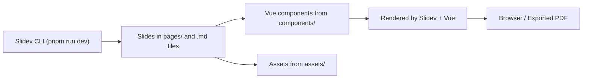

# Architecture

Last updated: 2025-09-21 17:38:22 UTC
Commit: f59d142

This repository is a Slidev-based presentation site. It follows a simple static-site layout using Vue and Slidev.

Top-level structure:

- `pages/` — slide files and top-level pages used by Slidev.
- `components/` — Vue components used across slides/pages.
- `assets/` — images and static assets referenced by slides and components.
- `styles/` — global styles and theme overrides.
- `snippets/` — reusable content fragments for slides.

Flow (high level):

Notes:
- The project uses Slidev to serve and build slides: see `package.json` scripts `dev`, `build`, `export`.
- Styling and theming use `styles/` and installed Slidev themes in `package.json`.
