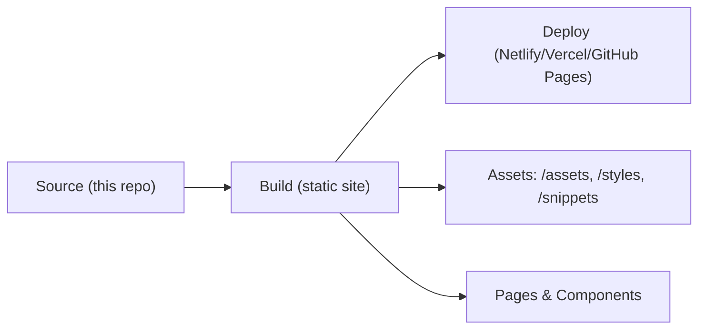

# Architecture

Last updated: 2025-09-21 14:15 (commit eabb9a0)

This repository is a static site / presentation focused project built with web frameworks (Node.js + frontend). The codebase layout at a high level:

- Root: static assets, slides and site config (`netlify.toml`, `vercel.json`).
- `pages/` and `components/` contain the frontend pages and UI components.
- `assets/`, `styles/`, and `snippets/` hold static content used by the presentation.

There is no server-side API in this repository — it's intended to be deployed as a static site (GitHub Pages / Netlify / Vercel).

Simple deployment flow (conceptual):

